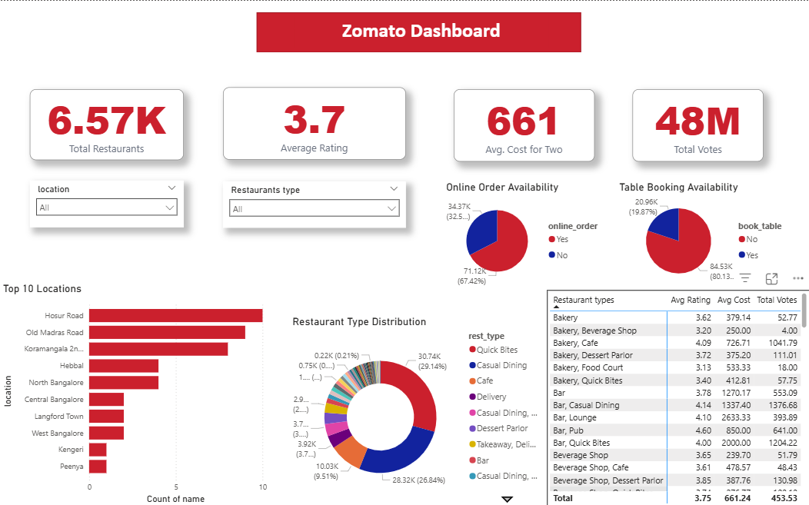

# 🍽️ Zomato Bengaluru - Data Analysis Dashboard

## 📖 Project Overview
This project presents an **interactive Power BI dashboard** built using Zomato’s Bengaluru restaurant dataset.  
The analysis focuses on uncovering **market saturation, consumer preferences, and digital adoption trends** within the restaurant industry.  

The goal is to deliver **data-driven insights** that can help restaurants, entrepreneurs, and food delivery platforms identify:  
- Which areas are oversaturated vs. underserved  
- What type of dining formats customers prefer  
- How digital services (online orders & table bookings) impact business success  

---

## ⚙️ Tech Stack
- **Power BI Desktop** → Dashboard creation & visualization  
- **Python (Pandas, NumPy, Matplotlib, Seaborn)** → Data preprocessing & exploratory analysis  
- **Excel / CSV** → Raw dataset storage and transformations  
- **Git & GitHub** → Version control & project hosting  

---

## 📊 Key Performance Indicators (KPIs)
The dashboard tracks the following key metrics for the Bengaluru restaurant ecosystem:

- **Total Restaurants** → 6.57K  
- **Average Rating** → ⭐ 3.7 / 5  
- **Average Cost for Two** → ₹661  
- **Total Votes** → 48M+ customer ratings  

---

## ⚡ Dashboard Features
- **Interactive Filters** → Slice data by *Location* and *Restaurant Type*  
- **Top 10 Location Analysis** → Identify the most saturated restaurant hubs  
- **Restaurant Type Distribution** → Market share of *Quick Bites, Casual Dining, Cafes*, etc.  
- **Service Availability** → % of restaurants offering *Online Ordering* and *Table Booking*  
- **Performance Matrix** → Compare restaurant types by average rating, cost, and total votes  

---

## 🔍 Business Insights
- **Market Opportunities**  
  - *Hosur Road & Old Madras Road* are highly competitive markets  
  - *Peenya & Kengeri* are underserved → **strong potential for new restaurants**  

- **Consumer Preferences**  
  - *Quick Bites (29%)* and *Casual Dining (26%)* dominate the market  
  - Indicates a clear demand for **affordable, fast, and casual dining experiences**  

- **Digital Adoption**  
  - **Online Ordering** → Over **67% adoption** → a must-have for survival in this market  
  - **Table Booking** → Only **~14% adoption** → still niche, limited customer preference  

